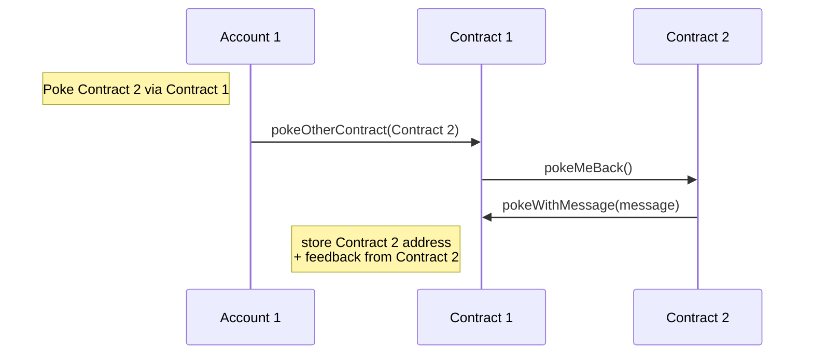

In the previous part, you created a simple dApp that included a frontend application and a smart contract backend.
In this part, you expand your development skills to include:

- More complex interactions between contracts
- Unit and mutation tests for contracts

In particular, you enhance the contract to be able to poke other contracts.
You also add the ability for a contract to respond when it is poked by another contract by sending a feedback message.

## Updated sequence diagram

This updated sequence diagram shows how the contract will work at the end of this part.
The user calls one contract, that contract calls a second contract, and the second contract responds to the first contract with a feedback message:



## Getting the code

If you haven't completed the previous part, you can download the completed code from this repository: https://github.com/trilitech/tutorial-applications

To set it up, run these commands:

1. Clone the repository locally:

   ```bash
   git clone https://github.com/trilitech/tutorial-applications.git
   ```

1. Install its dependencies:

   ```bash
   cd dapp/part-1/pokeGame
   yarn install
   cd ../frontend
   yarn install
   ```

## Modifying the poke function

The storage needs to be changed to reflect two ways that a contract can be poked, with and without a message.

For this reason, the storage needs to store two things:

- The feedback message that this contract provides to contracts that poke it
- A map of the addresses that have poked the contract and the feedback that they sent.

1. Edit the file `./contracts/pokeGame.jsligo` and replace the storage definition with this code:

   ```jsligo
   export type storage = {
     messages: map<address, string>,
     feedback: string
   };
   ```

   This update changes the data type of the poke history to be a map data type.
   The key is the address of the account that poked the contract and the value is the message that it sent, if any.

1. Replace the poke entrypoint with this code:

   ```jsligo
   // Simple poke with no message
   @entry
   const poke = (_: unit, storage: storage): return_type =>
     [
       [],
       {
         ...storage,
         messages: Map.add(Tezos.get_sender(), "", storage.messages),
       }
     ];
   ```

   This update changes the return value to match the new type of the storage.

1. Add a second entrypoint to allow callers to poke and send a message:

   ```jsligo
   // Poke with message
   @entry
   const pokeWithMessage = (message: string, storage: storage): return_type =>
     [
       [],
       {
         ...storage,
         messages: Map.add(Tezos.get_sender(), message, storage.messages),
       }
     ];
   ```

   This entrypoint is like the previous entrypoint but accepts a string parameter and stores that string in the map along with the address of the caller.

1. Edit `pokeGame.storageList.jsligo` to change the initial storage:

   ```jsligo
   #import "pokeGame.jsligo" "Contract"

   const default_storage: Contract.storage = {
     messages: Map.empty as map<address, string>,
     feedback: "Hello!"
   };
   ```

   Similar to the previous step, this code must match the new type of the storage.
   You can set any string value for your contract's feedback message that you want.

1. Compile the contract.

   ```bash
   taq compile pokeGame.jsligo
   ```

Before you deploy the new contract, you add tests in the next section.

## Writing unit tests

It's critical to test contracts before deploying them because you can't change a contract after it is deployed.
These steps add unit tests for the contract:

1. Add a contract file named `unit_pokeGame.jsligo` to contain the tests:

   ```bash
   taq create contract unit_pokeGame.jsligo
   ```

1. Open the file and change the default code to this unit test:

   ```jsligo
   #import "./pokeGame.jsligo" "PokeGame"

   import Test = Test.Next;
   import Tezos = Tezos.Next;

   export const setUpAccounts = ((): [address, address] => {
     // Set up test account
     Test.State.reset(2 as nat, list([]) as list<tez>);
     const account1: address = Test.Account.address(0);
     const account2: address = Test.Account.address(1);
     Test.IO.log(
       "Account 1 has address "
       + Test.String.show(account1)
       + " and balance "
       + Test.String.show(Test.Address.get_balance(account1))
     );
     return [account1, account2];
   });

   const accounts = setUpAccounts();

   // Default storage
   export const initial_storage: PokeGame.storage = {
     messages: Map.empty,
     feedback: "Hello"
   };

   // Deploy contract and return its typed address
   const deployInitialContract = ((): typed_address<parameter_of PokeGame.PokeGame, PokeGame.storage> => {
     const contract1 = Test.originate(contract_of(PokeGame.PokeGame), initial_storage, 0mutez);
     Test.IO.log(
       "Deployed contract 1 to: "
       + Test.String.show(Test.Typed_address.to_address(contract1.taddr))
     );
     return contract1.taddr;
   });


   export const unitTest = (
     accounts: [address, address],
     contract1_taddr: typed_address<parameter_of PokeGame.PokeGame, PokeGame.storage>
   ): unit => {

     const [account1, _account2] = accounts;

     // Simulate a transaction
     Test.State.set_source(account1);
     const result1 = Test.Contract.transfer(Test.Typed_address.get_entrypoint("poke", contract1_taddr), unit, 0tez);
     match(result1) {
       when(Fail(_err)): failwith("Transaction failed");
       when(Success(_s)): Test.IO.log("Transaction succeeded");
     };

     // Verify that the poke was stored in storage
     const storage1: PokeGame.storage = Test.get_storage(contract1_taddr);
     Test.IO.log(storage1);
     match(Map.find_opt(account1, storage1.messages)) {
       when(Some(message)): Assert.assert(message == "");
       when (None()): Assert.assert(false);
     };

     // Try poking with a message
     const result2 = Test.Contract.transfer(Test.Typed_address.get_entrypoint("pokeWithMessage", contract1_taddr), "Test message", 0tez);
     match(result2) {
       when(Fail(_err)): failwith("Transaction failed");
       when(Success(_s)): Test.IO.log("Transaction succeeded");
     };

     // Verify that the poke was stored in storage
     const storage2: PokeGame.storage = Test.get_storage(contract1_taddr);
     Test.IO.log(storage2);
     match(Map.find_opt(account1, storage2.messages)) {
       when(Some(message)): Assert.assert(message == "Test message");
       when (None()): Assert.assert(false);
     };

     // Deploy another contract
     const contract2Feedback = "You poked me!";
     const contract2 = Test.originate(contract_of(PokeGame.PokeGame), { ...initial_storage, feedback: contract2Feedback }, 0mutez);
     const contract2Address = Test.Typed_address.to_address(contract2.taddr);
     Test.IO.log(
       "Deployed contract 2 to: "
       + Test.String.show(contract2Address)
     );

     // Poke contract 2 via contract 1
     const result3 = Test.Contract.transfer(Test.Typed_address.get_entrypoint("pokeOtherContract", contract1_taddr), contract2Address, 0tez);
     match(result3) {
       when(Fail(_err)): failwith("Transaction failed");
       when(Success(_s)): Test.IO.log("Transaction succeeded");
     };

     // Check that contract 2 called pokeMe in response
     const storage3: PokeGame.storage = Test.get_storage(contract1_taddr);
     Test.IO.log(storage3);
     match(Map.find_opt(contract2Address, storage3.messages)) {
       when(Some(message)): Assert.assert(message == contract2Feedback);
       when (None()): Assert.assert(false);
     };

   };

   const testContract = ((): unit => unitTest(accounts, deployInitialContract()))();

   ```

   This file structures the test into a few functions so you can reuse code in mutation tests later.
   Here's a summary of what happens in this unit test:

   - The `setUpAccounts` function initializes the test with two test accounts with some tez and returns the addresses of those accounts.
   - For convenience, the test defines a variable named `initial_storage` for the initial storage of the contract deployed in the test.
   - The `deployInitialContract` function deploys the contract with the initial storage and returns its address.
   - The `unitTest` function receives the test account addresses and smart contract address, simulates transactions on the contract, and verifies that its storage changed as expected.
   - The `testContract` IIFE calls the other functions to actually run the tests.

   The unit test itself, in the `unitTest` function, uses the `Test.Contract.transfer` function to call the entrypoints in the contract.
   Then it uses the `Test.get_storage` function to get the current state of the contract's storage and check that it has stored the message correctly.

   Your tests can include any number of calls to contracts.
   Later in this section, you deploy a second contract in the test and verify that the contracts can call each other.

1. Run the test:

   ```bash
   taq test unit_pokeGame.jsligo
   ```

   The output prints the logging messages from the test and  the result, as in this example:

   ```shell-session
   ┌──────────────────────┬─────────────────────────────────────────────────────────────────────────────────────────────┐
   │ Contract             │ Test Results                                                                                │
   ├──────────────────────┼─────────────────────────────────────────────────────────────────────────────────────────────┤
   │ unit_pokeGame.jsligo │ "Account 1 has address tz1MBWU1WkszFfkEER2pgn4ATKXE9ng7x1sR and balance 3800000000000mutez" │
   │                      │ "Deployed contract 1 to: KT1KjLNqWWYuTWfdaijJ4HgdGUkA2QVctUEv"                              │
   │                      │ "Transaction succeeded"                                                                     │
   │                      │ {feedback = "Hello" ; messages = [tz1MBWU1WkszFfkEER2pgn4ATKXE9ng7x1sR -> ""]}              │
   │                      │ "Transaction succeeded"                                                                     │
   │                      │ {feedback = "Hello" ; messages = [tz1MBWU1WkszFfkEER2pgn4ATKXE9ng7x1sR -> "Test message"]}  │
   │                      │ Everything at the top-level was executed.                                                   │
   │                      │ - testContract exited with value ().                                                        │
   │                      │                                                                                             │
   │                      │ 🎉 All tests passed 🎉                                                                      │
   └──────────────────────┴─────────────────────────────────────────────────────────────────────────────────────────────┘
   ```

## Making an inter-contract call

Up to this point you have used user accounts to call contracts, but contracts can also call contracts.
To call another contract, the contract creates an [operation](/smart-contracts/logic/operations) that represents the call to the other contract and returns it at the end of the entrypoint.

As described in [Order of execution](/smart-contracts/logic/operations#order-of-execution), calls to other contracts happen asynchronously, and in a different order than you might expect.
The operations that a contract returns run only after its own code has completed running.
For example, if a contract checks its balance, creates an operation to transfer tez to another account, and then immediately checks its balance again, its balance has not changed because the operation has not run yet.
The operation runs only after the contract has completed running and returned the new operation.

1. In the `pokeGame.jsligo` file, add this new entrypoint after the two existing entrypoints:

   ```jsligo
   // Poke a different contract
   @entry
   const pokeOtherContract = (targetAddress: address, storage: storage): return_type => {
     const contract = Tezos.get_contract(targetAddress);
     const parameter = PokeMeBack() as parameter_of MockPokeContract;
     const op = Tezos.Operation.transaction(parameter, 0tez, contract);
     // How do I use self or this here?
     // This may not be quite as good as using contract<feedback_param> but I don't understand exactly what's going in there; are we passing the schema for the contract to make more flexible the process of calling the other contract?
     return [[op], storage];
   }
   ```

   This entrypoint accepts the address of another poke contract as a parameter.
   Then it creates an operation to call that contract's `pokeMeBack` entrypoint, which you create in the next step.
   Importantly, note that it returns this operation in the list of operations; if it doesn't return the operation, the operation doesn't run.

   TODO fix this call to MockPokeContract

1. Add this entrypoint to receive a poke from another contract:

   ```jsligo
   // Receive a request from another contract and poke them back
   @entry
   const pokeMeBack = (_: unit, storage: storage): return_type => {
     const contract = Tezos.get_contract(Tezos.get_sender());
     const parameter = PokeWithMessage(storage.feedback) as parameter_of MockPokeContract;
     const op = Tezos.Operation.transaction(parameter, 0tez, contract);
     return [[op], storage];
   }
   ```

   This entrypoint receives the call from the `pokeOtherContract` entrypoint and calls that contract's `pokeWithMessage` entrypoint.

1. Make sure that the contract compiles by running `taq compile pokeGame.jsligo`.

1. In the `unit_pokeGame.jsligo` file, add this code to the end of the `unitTest` function:

   ```jsligo
   // Deploy another contract
   const contract2Feedback = "You poked me!";
   const contract2 = Test.originate(contract_of(PokeGame.PokeGame), { ...initial_storage, feedback: contract2Feedback }, 0mutez);
   const contract2Address = Test.Typed_address.to_address(contract2.taddr);
   Test.IO.log(
     "Deployed contract 2 to: "
     + Test.String.show(contract2Address)
   );

   // Poke contract 2 via contract 1
   const result3 = Test.Contract.transfer(Test.Typed_address.get_entrypoint("pokeOtherContract", contract1_taddr), contract2Address, 0tez);
   match(result3) {
     when(Fail(_err)): failwith("Transaction failed");
     when(Success(_s)): Test.IO.log("Transaction succeeded");
   };

   // Check that contract 2 called pokeMe in response
   const storage3: PokeGame.storage = Test.get_storage(contract1_taddr);
   Test.IO.log(storage3);
   match(Map.find_opt(contract2Address, storage3.messages)) {
     when(Some(message)): Assert.assert(message == contract2Feedback);
     when (None()): Assert.assert(false);
   };
   ```

   This code deploys a new copy of the contract with the `Test.originate` function.
   Then it pokes new contract via the first contract's `pokeOtherContract` entrypoint and verifies that the contract's storage updates correctly.
   If it does, that means that contract 1 successfully created an operation to call contract 2, and that contract 2 created an operation to call it back.

1. Run the test:

   ```bash
   taq test unit_pokeGame.jslig
   ```

Now you can test that your contracts can make calls to other contracts.

## Updating the frontend

In this section, you deploy the updated contract and update the frontend application to show the messages that contracts received from other contracts:

1. Optional: Change the `feedback` field in the `PokeGame.storageList.jsligo` file.

1. Compile the contract:

   ```bash
   taq compile pokeGame.jsligo
   ```

1. Deploy the contract:

   ```bash
   taq deploy pokeGame.tz -e "testing"
   ```

1. Regenerate the types:

   ```bash
   taq generate types ../frontend/src
   ```

1. In the frontend application, update the `<tbody>` tag to have this code:

   ```jsx
   <tbody>
     {contracts.map((contract) =>
     <tr>
       <td style={{ borderStyle: "dotted" }}>{contract.address}</td>
       <td style={{ borderStyle: "dotted" }}>{(contract.storage !== null && contract.storage.messages !== null && Object.entries(contract.storage.messages).length > 0) ? <ul>{Object.keys(contract.storage.messages).map((k: string) => <li style={{textAlign: "left" }}>{(contract.storage.messages[k] || "no message ") + " from " + k}</li>)}</ul> : ""}</td>
       <td style={{ borderStyle: "dotted" }}>
         <form onSubmit={(e) => poke(e, contract)}>
           <input type="text" onChange={e => setContractToPoke(e.currentTarget.value)} placeholder='enter contract address here' />
           <button type='submit'>Poke</button>
         </form>
       </td>
     </tr>)}
   </tbody>
   ```

1. In the React variables, add this variable to store the contract to poke:

   ```js
   const [contractToPoke, setContractToPoke] = useState<string>('');
   ```

1. Change the `poke` function to call the `pokeOtherContract` entrypoint:

   ```js
   const poke = async (
     e: React.FormEvent<HTMLFormElement>,
     contract: api.Contract
   ) => {
     e.preventDefault();
     let c: PokeGameWalletType = await Tezos.wallet.at('' + contract.address);
     try {
       const op = await c.methodsObject
         .pokeOtherContract(contractToPoke as address)
         .send();
       await op.confirmation();
       alert('Tx done');
     } catch (error: any) {
       console.log(error);
       console.table(`Error: ${JSON.stringify(error, null, 2)}`);
     }
   };
   ```

1. Reload the page.

   Now the frontend shows contracts that match your new contract and the messages that they have received:

   

1. Copy the address of another contract, paste it into the input field for your contract, click `poke` and approve the transaction in your wallet.

1. Wait for the transaction to complete and then click **Fetch contracts**.
The table shows the message that that contract sent to your contract:

   


Now you have deployed a contract that can interact with other contracts autonomously.
You can deploy as many copies of this contract as you want and use them to send messages to each other.

## Writing mutation tests

LIGO provides mutation testing through the Test library. Mutation tests are like `testing your tests` to see if your unit test coverage is strong enough. Bugs, or mutants, are automatically inserted into your code. Your tests are run on each mutant.

If your tests fail then the mutant is killed. If your tests passed, the mutant survived.
The higher the percentage of mutants killed, the more effective your tests are.

[Example of mutation features for other languages](https://stryker-mutator.io/docs/mutation-testing-elements/supported-mutators)

1. Create a file `mutation_pokeGame.jsligo`.

   ```bash
   taq create contract mutation_pokeGame.jsligo
   ```

1. Edit the file.

   ```jsligo
   #import "./pokeGame.jsligo" "PokeGame"

   #import "./unit_pokeGame.jsligo" "PokeGameTest"

   // reset state

   const _ = Test.reset_state(2 as nat, list([]) as list<tez>);

   const faucet = Test.nth_bootstrap_account(0);

   const sender1: address = Test.nth_bootstrap_account(1);

   const _1 = Test.log("Sender 1 has balance : ");

   const _2 = Test.log(Test.get_balance_of_address(sender1));

   const _3 = Test.set_baker(faucet);

   const _4 = Test.set_source(faucet);

   const _tests = (
     ta: typed_address<parameter_of PokeGame, PokeGame.storage>,
     _: michelson_contract<parameter_of PokeGame, PokeGame.storage>,
     _2: int
   ): unit => { return PokeGameTest._testPoke(ta, sender1); };

   const test_mutation =
     (
       (): unit => {
         const mutationErrorList =
           Test.originate_and_mutate_all(
             contract_of(PokeGame),
             PokeGameTest.initial_storage,
             PokeGameTest.initial_tez,
             _tests
           );
         match(mutationErrorList) {
           when ([]):
             unit
           when ([head, ..._tail]):
             do {
               Test.log(head);
               Test.assert_with_error(false, Test.to_string(head[1]))
             }
         };
       }
     )();
   ```

   Explanation:

   - `#import <SRC_FILE> <NAMESPACE>`: import your source code that will be mutated and your unit tests. For more information [module doc](https://ligolang.org/docs/language-basics/modules).
   - `const _tests = (ta: typed_address<parameter_of PokeGame, PokeGame.storage>, _: michelson_contract, _: int) : unit => {...`: you need to provide the test suite that will be run by the framework. Just point to the unit test you want to run.
   - `const test_mutation = (() : unit => {`: this is the definition of the mutations tests.
   - `Test.originate_module_and_mutate_all(CONTRACT_TO_MUTATE, INIT_STORAGE, INIT_TEZ_COST, UNIT_TEST_TO_RUN)`: This will take the first argument as the source code to mutate and the last argument as unit test suite function to run over. It returns a list of mutations that succeed (if size > 0 then bad test coverage) or an empty list (good, even mutants did not harm your code).

1. Run the test.

   ```bash
   TAQ_LIGO_IMAGE=ligolang/ligo:1.6.0 taq test mutation_pokeGame.jsligo
   ```

   Output:

   ```logs
   === Error messages for mutation_pokeGame.jsligo ===
   File "contracts/mutation_pokeGame.jsligo", line 43, characters 12-66:
   42 |             Test.log(head);
   43 |             Test.assert_with_error(false, Test.to_string(head[1]))
   44 |           }

   Test failed with "Mutation at: File "contracts/pokeGame.jsligo", line 52, characters 15-66:
   51 |     when (None()):
   52 |       failwith("Cannot find view feedback on given oracle address")
   53 |   };

   Replacing by: "Cannot find view feedback on given oracle addressCannot find view feedback on given oracle address".
   "
   Trace:
   File "contracts/mutation_pokeGame.jsligo", line 43, characters 12-66 ,
   File "contracts/mutation_pokeGame.jsligo", line 43, characters 12-66 ,
   File "contracts/mutation_pokeGame.jsligo", line 28, character 2 to line 47, character 5


   ===
   ┌──────────────────────────┬──────────────────────┐
   │ Contract                 │ Test Results         │
   ├──────────────────────────┼──────────────────────┤
   │ mutation_pokeGame.jsligo │ Some tests failed :( │
   └──────────────────────────┴──────────────────────┘
   ```

   Invaders are here.

   What happened?

   The mutation has altered a part of the code that is not tested, it was not covered, so the unit test passed.

   For a short fix, tell the Library to ignore this function for mutants.

1. Go to your source file pokeGame.jsligo, and annotate the function `pokeAndGetFeedback` with `@no_mutation`.

   ```jsligo
   @no_mutation
   @entry
   const pokeAndGetFeedback ...
   ```

1. Run again the mutation tests.

   ```bash
   TAQ_LIGO_IMAGE=ligolang/ligo:1.6.0 taq test mutation_pokeGame.jsligo
   ```

   Output

   ```logs
   ┌──────────────────────────┬────────────────────────────────────────────────────────────────────────────────────────────────────────────────────────────────────────────────┐
   │ Contract                 │ Test Results                                                                                                                                   │
   ├──────────────────────────┼────────────────────────────────────────────────────────────────────────────────────────────────────────────────────────────────────────────────┤
   │ mutation_pokeGame.jsligo │ "Sender 1 has balance : "                                                                                                                      │
   │                          │ 3800000000000mutez                                                                                                                             │
   │                          │ "contract deployed with values : "                                                                                                             │
   │                          │ KT1L8mCbuTJXKq3CDoHDxqfH5aj5sEgAdx9C(None)                                                                                                     │
   │                          │ Success (1330n)                                                                                                                                │
   │                          │ {feedback = "kiss" ; pokeTraces = [tz1hkMbkLPkvhxyqsQoBoLPqb1mruSzZx3zy -> {feedback = "" ; receiver = KT1L8mCbuTJXKq3CDoHDxqfH5aj5sEgAdx9C}]} │
   │                          │ "Sender 1 has balance : "                                                                                                                      │
   │                          │ 3800000000000mutez                                                                                                                             │
   │                          │ Everything at the top-level was executed.                                                                                                      │
   │                          │ - test_mutation exited with value ().                                                                                                          │
   │                          │                                                                                                                                                │
   │                          │ 🎉 All tests passed 🎉                                                                                                                         │
   └──────────────────────────┴────────────────────────────────────────────────────────────────────────────────────────────────────────────────────────────────────────────────┘
   ```


## Summary

Now, you can call other contracts and test smart contracts before deploying them.

When you are ready, continue to [Part 3: Tickets](/tutorials/dapp/part-3).
