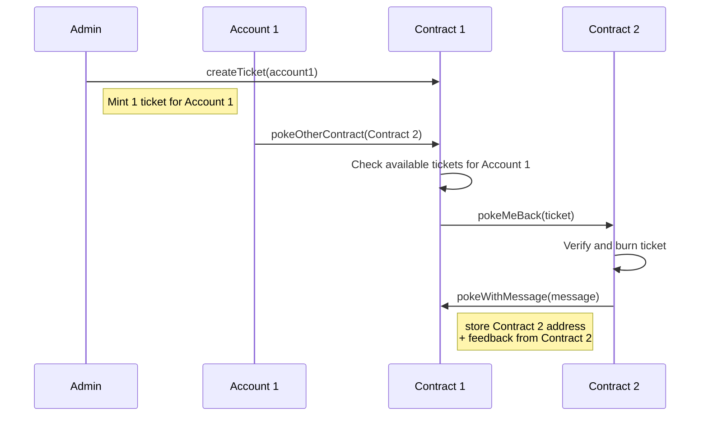

The contract you created in the previous part allows anyone to call it any number of times.
This flaw makes the contract susceptible to manipulation or other problems, such as overuse or infinite loops.
In this part you learn about a feature of Tezos that provides powerful authorization and security called _tickets_ and use these tickets to restrict poke requests.

## Tickets

Tickets are data types that contain three pieces of information:

- The address of the contract that created it, called the _ticketer_
- Some data with a type and value assigned by the contract, called the _wrapped value_ or the _payload_ of the ticket
- A natural number greater than zero, called the _amount_ of the ticket, which can represent a value like the number of tokens that a ticket represents

Tickets have a type, which is based on the type of the payload.
For example, a ticket with a payload of a string value is referred to in JsLIGO as `ticket<string>` or colloquially as a "string ticket."

Tickets have special restrictions that are enforced by the Tezos protocol, including:

- Tickets always have the address of the contract that created them as the ticketer and therefore cannot be forged
- Tickets cannot be duplicated, which introduces some restrictions in using them that will be described later
- The payload of a ticket cannot be changed after it is created
- The amount of a ticket can change only in specific ways: by splitting and joining tickets with the same ticketer and payload

For more information about tickets, see [Tickets](/smart-contracts/data-types#tickets).

## Updated sequence diagram

In this part you configure the contract to allow pokes by other contracts only when they include a ticket.
This ticket verifies that an administrator has provided permission for a specified account to poke.
This change means that the contract needs to keep track of an administrator account (the account that can authorize the creation of tickets) and include tickets with poke requests between contracts.

This diagram shows how the contract will work:



## Complexities of working with tickets

Tickets can be tricky to work with because they cannot be duplicated, even in intermediate code states.
This restriction might not seem like a big problem, but it causes issues because of how the Michelson stack-based language works.

For example, this sample contract stores an integer and an integer ticket.
It provides provides entrypoints to change the integer but does nothing to change the ticket:

```jsligo
type storage_type = {
  storedInt: int,
  storedTicket: ticket<int>,
};

type return_type = [list<operation>, storage_type];

namespace Counter {

  @entry
  const increment = (_: unit, storage: storage_type): return_type =>
    [[], {
      storedInt: storage.storedInt + 1,
      storedTicket: storage.storedTicket, // Error! Not duplicable
    }];

  @entry
  const decrement = (_: unit, storage: storage_type): return_type =>
    [[], {
      storedInt: storage.storedInt - 1,
      storedTicket: storage.storedTicket, // Error! Not duplicable
    }];
}
```

It doesn't look like the contract duplicates the ticket, but compiling it throws the error `Only duplicable types can be used with the DUP instruction and as view inputs and outputs`.

This error is due to how the Michelson language handles storage and logic.
Michelson is a stack-based language, which means that the commands and values in the contract are stored in an ordered list.
When the contract is executed, the current values in its storage are added to the stack and manipulated to be where the commands (or _instructions_ in Michelson terminology) need them to be to access them correctly.
If a variable is read more than once, the code uses the `DUP` instruction to copy the variable.
In this way, the Michelson code may duplicate a variable even if the code in a higher-level language like LIGO does not appear to.
Both entrypoints in the example read the `storage` variable twice, which causes the `DUP` instruction and the error.

Can you think of a way to read the `storage` variable only once per contract execution?
Here's a straightforward solution:

```jsligo
type storage_type = {
  storedInt: int,
  storedTicket: ticket<int>,
};

type return_type = [list<operation>, storage_type];

namespace Counter {

  @entry
  const increment = (_: unit, storage: storage_type): return_type => {
    const { storedInt, storedTicket } = storage;
    return [[], {
      storedInt: storedInt + 1,
      storedTicket: storedTicket,
    }];
  }

  @entry
  const decrement = (_: unit, storage: storage_type): return_type => {
    const { storedInt, storedTicket } = storage;
    return [[], {
      storedInt: storedInt - 1,
      storedTicket: storedTicket,
    }];
  }
}
```

The limitations on tickets mean that reading a ticket requires a special procedure.
Reading a ticket accesses it and therefore destroys it, because you can't access the same ticket again to include it in the contract's storage.
For this reason, when you read a ticket, the `Tezos.Ticket.read` function returns the information in the ticket and a new ticket that is identical to the old one.
You must use that new ticket in place of the old one.

For example, this contract expands on the previous example by reading the ticket, using the integer in the ticket, and returning the copy of the ticket in storage.
Like all variables, if you don't return a ticket as part of the contract's storage at the end of an entrypoint, it is destroyed.

```jsligo
import Tezos = Tezos.Next;

type storage_type = {
  storedInt: int,
  storedTicket: ticket<int>,
};
type return_type = [list<operation>, storage_type];

namespace Counter {

  @entry
  const increment ...

  @entry
  const decrement ...

  @entry
  const addTicketValue = (_: unit, storage: storage_type): return_type => {
    const { storedInt, storedTicket } = storage;
    const [[_ticketerAddress, [ticketInt, _amount]], newTicket] = Tezos.Ticket.read(storedTicket);
    // Now you can access the information in the ticket
    // But remember to return the new copy of the ticket
    return [[], {
      storedInt: storedInt + ticketInt,
      storedTicket: newTicket,
    }];
  }
}
```

Note that these restrictions also apply to tickets inside complex data types like tuples, lists, and maps.
For example, if a map contains tickets, you must read its values in a specific way to avoid duplicating the tickets.
For more information about working with tickets in JsLIGO, see [Tickets](https://ligo.tezos.com/docs/next/data-types/tickets?lang=jsligo) in the LIGO documentation.

## Getting the code

If you haven't completed the previous part, you can download the completed code from this repository: https://github.com/trilitech/tutorial-applications

To set it up, run these commands:

1. Clone the repository locally:

   ```bash
   git clone https://github.com/trilitech/tutorial-applications.git
   ```

1. Install its dependencies:

   ```bash
   cd dapp/part-2/pokeGame
   yarn install
   cd ../frontend
   yarn install
   ```

## Minting tickets

Minting is the action of creating a ticket.
Contracts can create any number of tickets, but for other contracts to treat them as secure and trustable values, there must be a secure process for creating them.
In this section, you create the ability for an administrator to trigger the contract to create tickets.
Currently, only contracts can create tickets, not user accounts.

1. Update the storage variables in the `contracts/pokeGame.jsligo` file to include a map of tickets and the address of an administrator account:

   ```jsligo
   type pokeTicket = ticket<address>

   export type storage = {
     tickets: map<address, pokeTicket>;
     messages: map<address, string>,
     feedback: string,
     admin: address,
   };
   ```

   The contract now stores a map of tickets that represent permission to poke another contract.

1. Similarly, update the `contracts/pokeGame.storageList.jsligo` file to match this new storage, including your account address as the administrator, represented here by the placeholder `<YOUR_ACCOUNT_ADDRESS>`:

   ```jsligo
   #import "pokeGame.jsligo" "Contract"

   const default_storage: Contract.storage = {
     messages: Map.empty as map<address, string>,
     feedback: "Hello!",
     admin: "<YOUR_ACCOUNT_ADDRESS>" as address,
     tickets: Map.empty,
   };
   ```

   Now when you deploy the contract with Taqueria, your account address will be in the storage as the administrator account that can cause the contract to create tickets.

1. In the `pokeGame.jsligo` contract, add an entrypoint that allows the administrator to create a ticket for a specified user account:

   ```jsligo
   // Admin only: create a poke ticket for a given address
   @entry
   const createTicket = (userAddress: address, storage: storage): return_type => {
     const { tickets, messages, feedback, admin } = storage;

     // Verify that the sender is the admin
     if (admin != Tezos.get_sender()) {
       failwith("Only the admin can call this entrypoint");
     }

     // To avoid overwriting and destroying an existing ticket, verify that the user does not have a ticket
     const [ticketOpt, updatedTickets] = Map.get_and_update(userAddress, None(), tickets);
     if (Option.is_some(ticketOpt)) {
       failwith("User already has a ticket")
     }

     // Mint the ticket
     const newTicket: pokeTicket = Option.value_with_error(
       "Ticket failed",
       Tezos.Ticket.create(userAddress, 1n)
     );

     // Return the storage with a new map of tickets
     return [
       [],
       {
         messages,
         feedback,
         admin,
         tickets: Map.add(userAddress, newTicket, updatedTickets),
       }
     ];
   }
   ```

   Note that this code uses the `Map.get_and_update` function to retrieve a ticket from the map in storage.
   This function avoids duplicating the tickets in the map by creating a new map that omits the ticket that you are retrieving.

1. Update the `poke` and `pokeWithMessage` entrypoints with this code:

   ```jsligo
   // Simple poke with no message
   @entry
   const poke = (_: unit, storage: storage): return_type => {
     const {tickets, messages, feedback, admin} = storage;
     return [
       [],
       {
         tickets,
         feedback,
         admin,
         messages: Map.add(Tezos.get_sender(), "", messages),
       }
     ]
   }

   // Poke with message
   @entry
   const pokeWithMessage = (message: string, storage: storage): return_type => {
     const {tickets, messages, feedback, admin} = storage;
     return [
       [],
       {
         tickets,
         feedback,
         admin,
         messages: Map.add(Tezos.get_sender(), message, messages),
       }
     ]
   }
   ```

1. Update the `pokeOtherContract` entrypoint to verify that the user trying to poke has a ticket and to include that ticket in the operation:

   ```jsligo
   // Poke a different contract
   @entry
   const pokeOtherContract = (targetAddress: address, storage: storage): return_type => {
     const {tickets, messages, feedback, admin} = storage;

     // Check that the user has a ticket
     const [ticketOpt, updatedTickets] = Map.get_and_update(Tezos.get_sender(), None(), tickets);
     const senderTicket = Option.value_with_error("No ticket from this sender", ticketOpt);

     const contract = Tezos.get_contract(targetAddress);
     const parameter = PokeMeBack(senderTicket) as parameter_of MockPokeContract;
     const op = Tezos.Operation.transaction(parameter, 0tez, contract);
     // How do I use self or this here?
     // This may not be quite as good as using contract<feedback_param> but I don't understand exactly what's going in there; are we passing the schema for the contract to make more flexible the process of calling the other contract?
     return [
       [op],
       {
         messages,
         feedback,
         admin,
         tickets: updatedTickets,
       }
       ];
   }
   ```

1. Update the `pokeMeBack` entrypoint to receive the ticket, verify that the address in the ticket matches the address of the account that initiated the chain of transactions, and send the poke transaction:

   ```jsligo
   // Receive a request from another contract and poke them back
   // Destroys the passed ticket
   @entry
   const pokeMeBack = (passedTicket: pokeTicket, storage: storage): return_type => {
     const {tickets, messages, feedback, admin} = storage;

     // Verify that the sender and ticket have the same address
     // This destroys the passedTicket variable if it succeeds
     const [[_ticketerAddress, [ticketAddress, _amount]], _newTicket] = Tezos.Ticket.read(passedTicket);
     if (Tezos.get_source() != ticketAddress) {
       failwith("Sender does not match ticket address");
     }

     // Create the operation to poke the other contract
     const contract = Tezos.get_contract(Tezos.get_sender());
     const parameter = PokeWithMessage(feedback) as parameter_of MockPokeContract;
     const op = Tezos.Operation.transaction(parameter, 0tez, contract);
     return [
       [op],
       {
         messages,
         feedback,
         admin,
         tickets,
       }
     ];
   }
   ```

1. Verify that the contract compiles by running this command:

   ```bash
   taq compile pokeGame.jsligo
   ```

   If the contract doesn't compile, check it against the code above or in the completed file in the [`tutorial-applications` repository](https://github.com/trilitech/tutorial-applications/blob/main/dapp/part-3).

Now the contract cannot be made to poke another contract without a ticket.
(The `poke` and `pokeWithMessage` entrypoints are still callable by user accounts, but you could update the contract to limit them in a similar way.)

## Updating the tests

The unit tests need to be updated to have the administrator account create a ticket for the user account that pokes.
They also must update how they validate the storage values of the contract.

1. In the `unit_pokeGame.jsligo` file, update the `unitTest` function to look like this:

   ```jsligo
   export const unitTest = (
     accounts: [address, address],
     contract1_taddr: typed_address<parameter_of PokeGame.PokeGame, PokeGame.storage>
   ): unit => {

     const [account1, account2] = accounts;

     // Simulate a transaction
     Test.State.set_source(account1);
     const result1 = Test.Contract.transfer(Test.Typed_address.get_entrypoint("poke", contract1_taddr), unit, 0tez);
     match(result1) {
       when(Fail(_err)): failwith("Transaction failed");
       when(Success(_s)): Test.IO.log("Transaction succeeded");
     };

     // Verify that the poke was stored in storage
     const storage1: PokeGame.storage = Test.get_storage(contract1_taddr);
     Test.IO.log(storage1);
     match(Map.find_opt(account1, storage1.messages)) {
       when(Some(message)): Assert.assert(message == "");
       when(None()): Assert.assert(false);
     };

     // Try poking with a message
     const result2 = Test.Contract.transfer(Test.Typed_address.get_entrypoint("pokeWithMessage", contract1_taddr), "Test message", 0tez);
     match(result2) {
       when(Fail(_err)): failwith("Transaction failed");
       when(Success(_s)): Test.IO.log("Transaction succeeded");
     };

     // Verify that the poke was stored in storage
     const storage2: PokeGame.storage = Test.get_storage(contract1_taddr);
     Test.IO.log(storage2);
     match(Map.find_opt(account1, storage2.messages)) {
       when(Some(message)): Assert.assert(message == "Test message");
       when (None()): Assert.assert(false);
     };

     // Deploy another contract
     const contract2Feedback = "You poked me!";
     const contract2 = Test.originate(contract_of(PokeGame.PokeGame), { ...initial_storage, feedback: contract2Feedback }, 0mutez);
     const contract2Address = Test.Typed_address.to_address(contract2.taddr);
     Test.IO.log(
       "Deployed contract 2 to: "
       + Test.String.show(contract2Address)
     );

     // Verify that account2 can't poke without a ticket
     Test.State.set_source(account2);
     const result3 = Test.Contract.transfer(Test.Typed_address.get_entrypoint("pokeOtherContract", contract1_taddr), contract2Address, 0tez);
      match(result3) {
       when(Fail(_err)): Test.IO.log("Successfully failed a poke from someone who didn't have a ticket");
       when(Success(_s)): failwith("Transaction should have been blocked");
     };

     // Admin creates a ticket for account 2
     Test.State.set_source(account1);
     const _ = Test.Contract.transfer_exn(Test.Typed_address.get_entrypoint("createTicket", contract1_taddr), account2, 0tez);
     const storage3: PokeGame.storage = Test.get_storage(contract1_taddr);
     match(Map.find_opt(account2, storage3.tickets)) {
       when(Some(ticket)): do {
         const [[_ticketerAddress, [ticketAddress, _amount]], _newTicket] = Tezos.Ticket.read(ticket);
         Assert.assert(ticketAddress == account2);
       }
       when (None()): Assert.assert(false);
     };

     // Poke contract 2 via contract 1
     Test.State.set_source(account2);
     const result4 = Test.Contract.transfer(Test.Typed_address.get_entrypoint("pokeOtherContract", contract1_taddr), contract2Address, 0tez);
     match(result4) {
       when(Fail(_err)): failwith(_err);
       when(Success(_s)): Test.IO.log("Transaction succeeded");
     };

     // Check that contract 2 called pokeMe in response
     const storage4: PokeGame.storage = Test.get_storage(contract1_taddr);
     Test.IO.log(storage4);
     match(Map.find_opt(contract2Address, storage4.messages)) {
       when(Some(message)): Assert.assert(message == contract2Feedback);
       when (None()): Assert.assert(false);
     };

   };
   ```

   This update includes using the administrator account to create a ticket for the other account and using that account to trigger the poke transactions.

1. Run the test:

   ```bash
   taq test unit_pokeGame.jsligo
   ```

   The test shows warnings for the places that the test retrieves the contract storage.
   These warnings are because the storage contains tickets and therefore can be read only once, as described above.
   Because this is a unit test and not a contract, you don't have to worry about losing tickets, so you can safely ignore these errors.

1. Compile the contract:

   ```bash
   taq compile pokeGame.jsligo
   ```

1. Deploy the contract:

   ```bash
   taq deploy pokeGame.tz -e "testing"
   ```

## Adapting the frontend code

The only major change that you need to make to the frontend application is to provide a way to call the `createTicket` entrypoint.

1. Regenerate the types:

   ```bash
   taq generate types ../frontend/src
   ```

1. Restart the frontend application by running `yarn dev` and verify that you can't poke the contract without a ticket.

   When you copy a contract address into an input field and click **Poke** as you did in the previous part, your wallet shows an error that the transaction is likely to fail with the error `No ticket from this sender`, which is the failure that the `pokeOtherContract` creates.
   In the process of calculating the transaction fee, the wallet simulates the transaction and sees that it fails.

   Different wallets show this failure in different ways, but as an example, here is the failure in the Temple wallet browser extension:

   

1. In the `src/App.txs` file, after the `poke` function, add this function to create a ticket:

   ```jsligo
   const createTicket = async (
     e: React.FormEvent<HTMLFormElement>,
     contract: api.Contract
   ) => {
     e.preventDefault();
     let c: PokeGameWalletType = await Tezos.wallet.at('' + contract.address);
     try {
       const op = await c.methodsObject
         .createTicket(userAddress as address)
         .send();
       await op.confirmation();
       alert('Ticket created');
     } catch (error: any) {
       console.log(error);
       console.table(`Error: ${JSON.stringify(error, null, 2)}`);
     }
   };
   ```

   This function is very similar to the `poke` function, but this function passes your wallet address to the `createTicket` entrypoint.
   It assumes that your account is the administrator and is creating a ticket for itself.
   You could extend this function to accept any address as the address to create a ticket for.

1. After the `<form>` element that calls the `poke` function, add this form to add a button to create a ticket:

   ```html
   <form onSubmit={(e) => createTicket(e, contract)}>
     <button type='submit'>Create ticket</button>
   </form>
   ```

1. Change the line `<td style={{ borderStyle: "dotted" }}>{contract.address}</td>` to this line:

   ```html
   <td style={{ borderStyle: "dotted" }}>{contract.address}<br /> Admin: {contract.storage.admin}</td>
   ```

1. Reload the page.
Now the page shows the administrator of each contract and a **Create ticket** button that the admin can use:

   

1. Create a ticket for the contract that you are the administrator of by clicking is **Create ticket** button and approving the transaction in your wallet.

1. As you did in the previous part, paste the address of another contract into that contract's text field, click **Poke**, and approve the transaction in your wallet.

1. Reload the contracts by clicking **Fetch contracts** and see the completed poke in the table:

   

1. Try poking again and see that the transaction fails because you used your only ticket.

## Summary

Now you see how you can implement complex, traceable authorization with tickets.
For more information about tickets, see [Tickets](/smart-contracts/data-types/complex-data-types#tickets).

From here, you can make many updates to the application, including:

- Requiring tickets for other entrypoints
- Tracking more than one ticket per user
- Using data in the ticket to pass information between contracts
- Putting a timestamp in the ticket and enforcing a time limit on pokes

When you are ready, continue to [Part 4: Smart contract upgrades](/tutorials/dapp/part-4).
